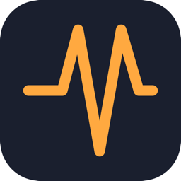
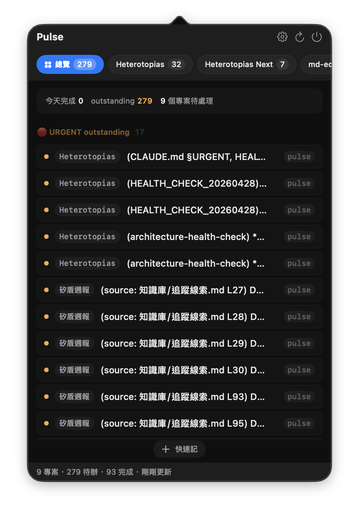
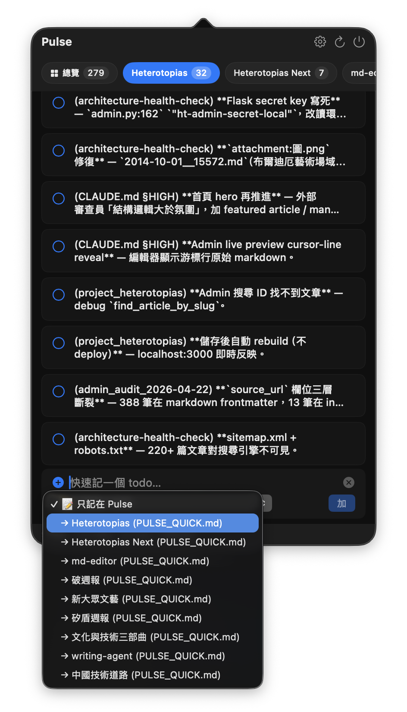
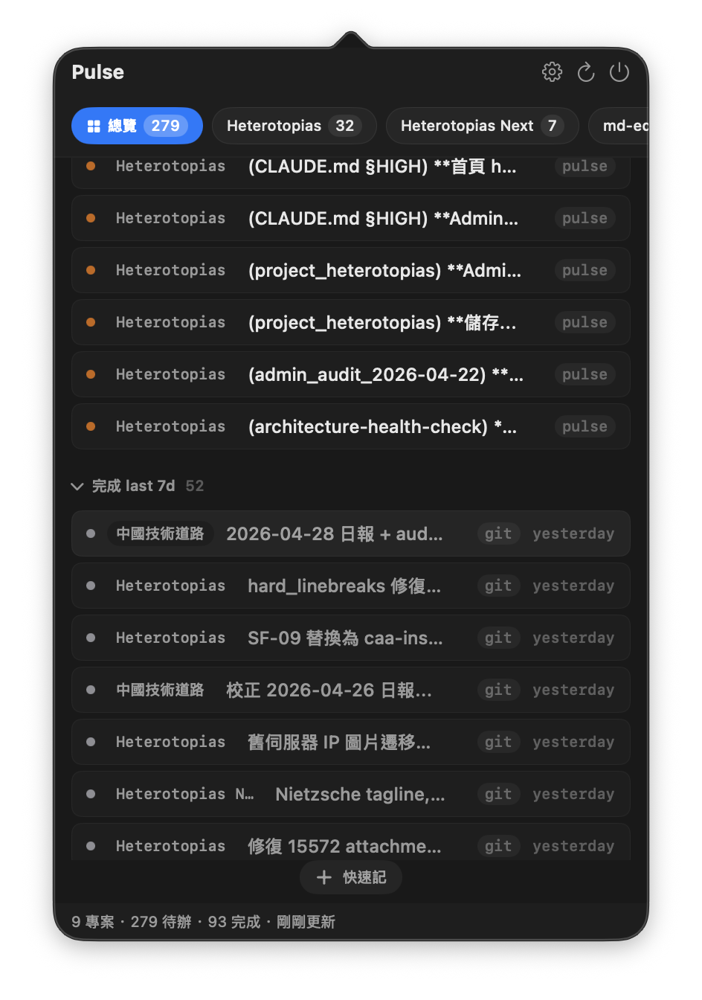
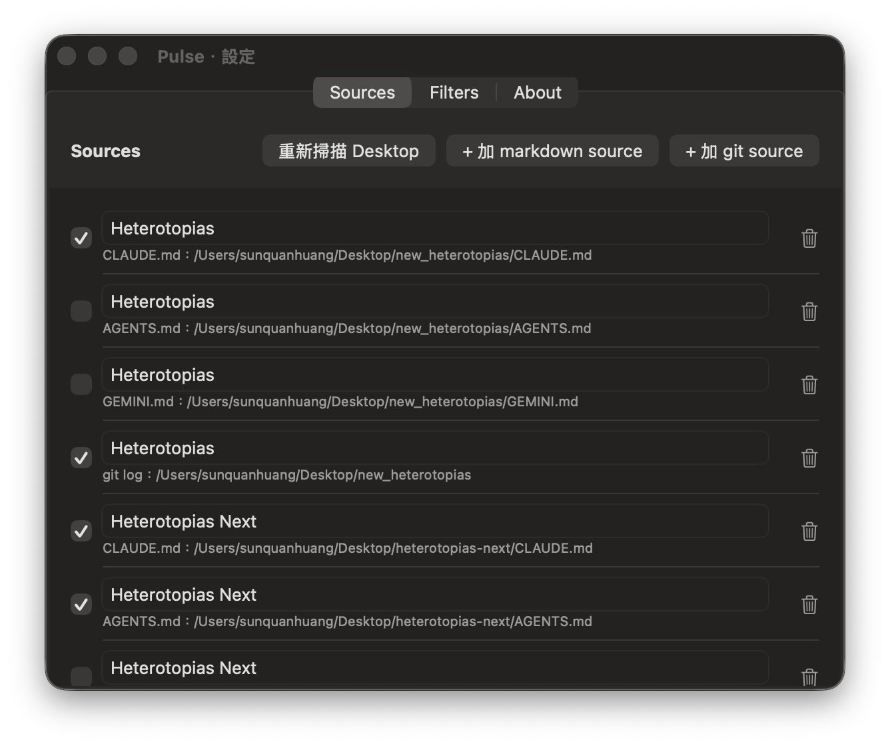

<p align="center">
  
</p>

<h1 align="center">Pulse</h1>

<p align="center"><em>Cross-project todo &amp; done aggregator for the macOS menubar.</em></p>

---

Built for developers who use AI coding assistants (Claude Code, Codex, Cursor, Gemini CLI) and work across many repos. Pulse passively reads your `CLAUDE.md` / `AGENTS.md` / `GEMINI.md` / `pulse.md` checkbox items and your `git log` conventional commits, then surfaces them in a single menubar popover so you can see what's outstanding and what just landed without `cd`-hopping between repositories.

## Screenshots

<table>
  <tr>
    <td width="50%">
      
      <p><strong>Overview · URGENT outstanding</strong><br>Cards aggregated across every tracked project, each tagged with a project chip and source-agent badge.</p>
    </td>
    <td width="50%">
      
      <p><strong>Quick todo composer</strong><br>Type once, choose whether the todo lives only inside Pulse or gets appended to a specific project's <code>pulse.md</code>.</p>
    </td>
  </tr>
  <tr>
    <td width="50%">
      
      <p><strong>Completed · last 7 days</strong><br><code>git log</code> commits and <code>pulse.md</code> <code>[x]</code> items merged chronologically with <code>git</code> / <code>pulse</code> agent badges.</p>
    </td>
    <td width="50%">
      
      <p><strong>Settings · Sources + Rescan Desktop</strong><br>Add / remove / toggle sources by hand, or click <em>Rescan Desktop</em> to find newly-added projects without restarting onboarding.</p>
    </td>
  </tr>
</table>

## Features

- **Overview tab** — one-line digest (today's done count, outstanding count, projects with outstanding work) plus cross-project sections: 🔴 URGENT outstanding, 🟡 HIGH outstanding, completed in the last 24h, completed in the last 7d (collapsed by default).
- **Per-project tabs** — drill into a single project's todos and recent commits.
- **Priority detection** — bullets prefixed with `🔴` / `🟡`, or grouped under `### 🔴 URGENT` / `### 🟡 HIGH` headings, are surfaced in the priority sections automatically. No config required.
- **Quick todo** — type a one-liner in the popover; either keep it Pulse-only or write it to a project's `pulse.md` so your AI assistant sees it on the next session.
- **Settings**
  - `Sources` — add / remove / toggle markdown and git sources.
  - `Filters` — pick a git commit filter preset (`Minimal` = `feat`/`fix` only, `Recommended`, `All`).
  - **Rescan Desktop** — find new projects added since onboarding.
- **Auto-refresh** — markdown sources update via `FSEventStream` with a 1-second debounce; git logs are scanned every 5 minutes as a backstop.
- **Keyboard** — `⌘,` Settings, `⌘R` Refresh, `⌘Q` Quit.

## Supported sources

| Source | What Pulse reads |
| --- | --- |
| `CLAUDE.md` | GitHub-flavored task list checkboxes (`- [ ]`, `- [x]`) under any heading |
| `AGENTS.md` | Same, for Codex / Cursor |
| `GEMINI.md` | Same, for Gemini CLI |
| `pulse.md` | Pulse's own convention; Quick Todo writes here |
| `git log` | Conventional Commits (`feat:`, `fix:`, `chore:`, etc.) from the last 30 days |

## Natural-language todos for non-coder researchers

When Pulse first detects a project, it writes a small "hook" block into that project's `CLAUDE.md`. The hook teaches Claude Code (and other compatible AI assistants) to recognise a set of natural-language trigger phrases and automatically append the resulting todo to the project's `pulse.md`. You never need to write Markdown checkbox syntax by hand, and you never need to leave the AI conversation to file a note.

This matters particularly for researchers, writers, scholars, and other non-coders who already use AI assistants for thesis revision, fieldwork notes, interview transcription, literature reviews, or grant drafting — anyone whose primary interaction with an AI is conversational rather than code-shaped.

| What you say to the AI | What the AI does |
| --- | --- |
| "Add todo X", "remember X", "TODO: X", "don't forget X" | Appends `- [ ] (today's date) X` under the `## To Do` heading of `<project>/pulse.md` |
| "Make X a priority", "do X first", "P0", "urgent" | Appends `- [ ] 🔴 (today's date) X`, automatically grouped under URGENT in the Pulse Overview |
| "X is high priority", "X is important" | Appends `- [ ] 🟡 (today's date) X`, automatically grouped under HIGH |
| "X is done", "finished X", "completed X" | Rewrites the corresponding `- [ ]` line as `- [x] (done today's date) X` |
| "Drop X", "remove X", "delete that one" | Removes the entire line |

The phrases are matched semantically by the AI assistant; you do not need to recite them verbatim. *"Please prioritise sorting out the bibliography for chapter three"* or *"the first interview transcript is now finalised"* trigger the same behaviour.

Once a todo lands in `pulse.md`, Pulse picks it up through filesystem monitoring (usually within a second or two) and surfaces it in the menubar popover. Your tracked projects collectively form a single working list, accessible at any moment without leaving the menubar — and without a single keystroke spent on Markdown.

## Install

Pulse is free and not signed by Apple, because paying $99/year for an Apple Developer ID just to ship a free open-source tool isn't a trade I'm willing to make. There are two install paths — pick whichever you prefer.

### Path A — download the dmg (one extra click on first open)

1. Download `Pulse-x.y.z.dmg` from the [GitHub Releases](https://github.com/inertia/pulse/releases) page.
2. Mount it, drag `Pulse.app` into `/Applications`.
3. **First launch only**: right-click `Pulse.app` in `/Applications` → `Open` → in the dialog click `Open` again. macOS won't ask after that.

If you skipped step 3 and already saw the "unidentified developer" warning, you can clear the quarantine attribute from the terminal:

```bash
xattr -dr com.apple.quarantine /Applications/Pulse.app
```

This is exactly what the right-click trick does under the hood. Either works.

### Path B — build from source (no dmg, no warning)

Build with your own toolchain. Locally-built apps don't go through Gatekeeper, so there's no warning to bypass.

```bash
brew install xcodegen     # one-time
git clone https://github.com/inertia/pulse.git
cd pulse
./Scripts/build-and-install.sh
```

The script generates the Xcode project, builds the Public Release configuration, copies `Pulse.app` to `/Applications`, and launches it. Takes about 30-60 seconds on first run.

### What happens on first launch

Pulse asks macOS for read access to common dev folders (`~/Desktop`, `~/Projects`, `~/code`, `~/Developer`, `~/Documents`), scans one level deep for projects containing the supported markdown files, and lets you pick which to track. After onboarding, Pulse lives in your menubar (no Dock icon) and starts watching the chosen sources.

## First-launch and daily use

**First launch**

1. Pulse asks macOS for permission to read the standard dev folders.
2. Onboarding scans for projects and shows them in a list with checkboxes.
3. Tick the projects you want, click Done.

**Daily use**

- Click the Pulse icon in the menubar to open the popover. Click anywhere outside to dismiss, or press `⌘W`.
- The Overview tab is selected by default and shows cross-project priority + recent work.
- Use the tab bar to switch to a per-project view when you need detail.
- The `+` button in the popover footer is the Quick Todo composer.

## Keyboard shortcuts

| Shortcut | Action |
| --- | --- |
| `⌘,` | Open Settings |
| `⌘R` | Refresh sources now |
| `⌘Q` | Quit Pulse |
| `⌘W` | Close popover |

## Privacy and the read-only contract

Pulse is **read-only against the files you point it at**. It will never modify your `CLAUDE.md`, `AGENTS.md`, `GEMINI.md`, or any file in a `.git` directory. The single exception is `pulse.md`, which is Pulse's own convention — when you use Quick Todo and target a project, Pulse appends a single line to that project's `pulse.md` (creating the file if it doesn't exist).

You can verify the read-only contract by running `./Scripts/verify-readonly.sh` (requires `jq`: `brew install jq`).

Pulse does not phone home, does not collect telemetry, and does not require a network connection.

## System requirements

- macOS 14 Sonoma or later
- Apple Silicon or Intel
- About 30 MB disk; a few MB RAM

## Contributing

Issues and pull requests are welcome at [github.com/inertia/pulse](https://github.com/inertia/pulse). Please open an issue first for non-trivial changes so we can align on direction before you write code.

## License

MIT — see [LICENSE](LICENSE).

---

## 中文說明

Pulse 是一款 macOS 工具列應用程式（menubar app），用於將使用者各個專案中的待辦事項與近期完成項目匯整於單一下拉視窗中，免去逐一切換資料夾以掌握進度的不便。

本應用程式專為以下使用情境設計：

- 平日使用 Claude Code、Codex、Cursor、Gemini CLI 等 AI 助手協同寫作或研究的工作者
- 同時進行多個專案，需要在工具列即時掌握各專案進度者
- **未必熟悉程式碼，但經常透過 AI 助手執行研究與寫作的學者**（詳見下方「研究者適用之核心功能」）

### Pulse 讀取的資料來源

Pulse 採**唯讀**方式存取下列檔案，不會回寫任何內容（`pulse.md` 之「快速記」功能屬例外，後段另行說明）：

- `CLAUDE.md`：Claude Code 使用的待辦 checkbox（`- [ ] 任務內容`）
- `AGENTS.md`：Codex 與 Cursor 使用的待辦 checkbox
- `GEMINI.md`：Gemini CLI 使用的待辦 checkbox
- `pulse.md`：Pulse 自身的命名慣例，供 AI 助手自動寫入
- `git log`：近 30 日的 commit 紀錄，並自動篩選 `feat:`、`fix:`、`chore:` 等規範化 commit

待辦標題若以 🔴 開頭，或其所屬章節標題包含 🔴（例如 `### 🔴 URGENT / P0`），將自動歸類於 URGENT 區段；🟡 同理歸入 HIGH 區段。不需任何手動分類設定。

### 研究者適用之核心功能：以自然語言指示 AI，待辦自動納入 Pulse

Pulse 首次掃描到專案時，會於該專案之 `CLAUDE.md` 寫入一段「鉤子」（hook block），使 Claude Code 等 AI 助手能識別下列觸發語：

| 對 AI 之指示 | AI 自動執行之動作 |
|---|---|
| 「加 todo X」、「記下來」、「不要忘記 X」、「TODO: X」 | 於 `<專案>/pulse.md` 的 `## To Do` 段附加 `- [ ] (當日日期) X` |
| 「優先處理 X」、「要先做 X」、「P0」、「緊急」 | 附加 `- [ ] 🔴 (當日日期) X`，並自動歸入 Pulse 的 URGENT 區段 |
| 「高優先 X」、「重要的 X」 | 附加 `- [ ] 🟡 (當日日期) X`，並自動歸入 HIGH 區段 |
| 「X 完成了」、「X 做完了」、「done X」、「finished X」 | 將對應之 `- [ ]` 標記為 `- [x] (done 當日日期) X` |
| 「刪掉 X」、「不要這條 X」、「拿掉 X」、「remove X」 | 移除整行 |

此項功能對於撰寫論文、進行田野工作、整理訪談稿之研究者尤具實效：日常與 AI 對話過程中所提及之指示（例如「優先處理博士論文之引用考據」、「該篇訪談稿已完成校對」），其內容將自動進入 Pulse 之待辦清單，無需熟悉 markdown checkbox 語法，亦無需手動編輯任何檔案。

開啟 Pulse 工具列即可於單一視窗中跨專案綜覽所有「曾向 AI 提出之待辦」。

### 安裝

Pulse 並未簽署 Apple 開發者憑證（年費 99 美元，免費開源工具不負擔此項支出）。安裝方式有以下兩種，擇一即可。

**方式 A：下載 dmg**（操作簡便，惟首次開啟須以右鍵啟用）

1. 自 [GitHub Releases](https://github.com/inertia/pulse/releases) 頁面下載 `Pulse-x.y.z.dmg`
2. 掛載 dmg，將 `Pulse.app` 拖移至 `/Applications`
3. **首次開啟**：於 `/Applications` 中找到 Pulse.app，**按右鍵 → 打開**，於對話框中再次點選「打開」。後續啟動將不再出現提示

若已直接雙擊並出現「無法驗證開發者」警告，可於終端機輸入下列指令清除警告標記：

```bash
xattr -dr com.apple.quarantine /Applications/Pulse.app
```

**方式 B：自原始碼編譯**（需 Xcode 命令列工具與 Homebrew）

```bash
brew install xcodegen
git clone https://github.com/inertia/pulse.git
cd pulse
./Scripts/build-and-install.sh
```

腳本將自動產生 Xcode 專案、編譯、複製至 `/Applications` 並啟動。首次執行約需 30 至 60 秒。

### 首次啟動

Pulse 將請求 `~/Desktop`、`~/Projects`、`~/code`、`~/Developer`、`~/Documents` 等常見開發資料夾之讀取權限，並於子目錄一層內搜尋包含 `CLAUDE.md` / `AGENTS.md` / `GEMINI.md` 之專案，呈現清單供使用者勾選欲追蹤之項目。

完成後 Pulse 常駐於工具列（不佔用 Dock 圖示）。如欲設定開機自動啟動，可於系統設定 → 一般 → 登入項目中新增。

### 日常操作

- **點擊工具列之 amber 脈搏圖示** 即可展開 popover
- **總覽分頁**（最左側，預設選取）：跨專案 digest，包含 URGENT 待辦、HIGH 待辦、近 24 小時完成項、近 7 日完成項
- **各專案分頁**：切換以查看單一專案之詳細卡片
- **快速記 `+` 按鈕**（popover 下方）：可記錄一條待辦事項；可選擇僅保存於 Pulse 內部，或寫入某專案之 `pulse.md`，供 AI 助手於下次 session 載入時讀取
- 點擊 popover 範圍以外之任何位置，或按 `⌘W`，皆可關閉視窗

### 鍵盤快速鍵

| 快速鍵 | 對應動作 |
|---|---|
| `⌘,` | 開啟設定面板（管理 sources、過濾規則、重新掃描 Desktop） |
| `⌘R` | 立即更新所有 source |
| `⌘Q` | 結束 Pulse |
| `⌘W` | 收合 popover |

### 隱私與唯讀契約

Pulse **不會修改**所追蹤之 `CLAUDE.md` / `AGENTS.md` / `GEMINI.md` 或任何 `.git` 目錄內之檔案。唯一例外為 `pulse.md`：使用「快速記」並指定某專案時，Pulse 將於該專案之 `pulse.md` 結尾附加一行待辦（檔案若不存在則自動建立）；AI 助手經由 hook 觸發語寫入 `pulse.md` 亦循此路徑。

Pulse 不上傳任何資料至雲端，無 telemetry 蒐集機制，亦不需網路連線。

如欲驗證唯讀契約，可執行 `./Scripts/verify-readonly.sh`（需事先以 `brew install jq` 安裝相依套件）。

### 系統需求

- macOS 14（Sonoma）或更新版本
- Apple Silicon 與 Intel 處理器皆支援
- 約 30 MB 硬碟空間，數 MB 記憶體

### 反饋與貢獻

Bug 回報、功能建議、實作構想，歡迎於 [github.com/inertia/pulse/issues](https://github.com/inertia/pulse/issues) 提交 issue。較具規模之變更，建議先開立 issue 討論方向，再行送出 pull request。

### 授權

採 MIT 授權，詳見 [LICENSE](LICENSE)。
